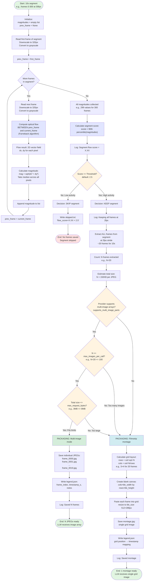

```mermaid
flowchart TD
    Start([Start: 10s segment<br/>e.g., frames 0-300 at 30fps]) --> InitVars[Initialize:<br/>magnitudes = empty list<br/>prev_frame = None]
    
    InitVars --> ReadFirst[Read first frame of segment<br/>Downscale to 320px<br/>Convert to grayscale]
    ReadFirst --> SetPrev[prev_frame = first_frame]
    
    SetPrev --> LoopStart{More frames<br/>in segment?}
    
    LoopStart -->|Yes| ReadCurrent[Read next frame<br/>Downscale to 320px<br/>Convert to grayscale]
    ReadCurrent --> CalcFlowPair["Compute optical flow<br/>BETWEEN prev_frame and current_frame<br/>(Farneback algorithm)"]
    
    CalcFlowPair --> FlowResult[Flow result: 2D vector field<br/>dx, dy for each pixel]
    FlowResult --> CalcMag["Calculate magnitude:<br/>mag = sqrt(dx² + dy²)<br/>Take median across all pixels"]
    CalcMag --> AppendMag[Append magnitude to list]
    AppendMag --> UpdatePrev[prev_frame = current_frame]
    UpdatePrev --> LoopStart
    
    LoopStart -->|No| AllMags[All magnitudes collected<br/>e.g., 299 values for 300 frames]
    
    AllMags --> CalcScore["Calculate segment score:<br/>score = 90th percentile(magnitudes)"]
    CalcScore --> LogScore[Log: Segment flow score = X.XX]
    
    LogScore --> CompareThreshold{Score >= Threshold?<br/>default: 2.5}
    
    CompareThreshold -->|No: Low activity| SkipSegment[Decision: SKIP segment]
    SkipSegment --> WriteSkipped[Write skipped.txt:<br/>'flow_score=X.XX < 2.5']
    WriteSkipped --> EndSkip([End: No frames saved<br/>Segment skipped])
    
    CompareThreshold -->|Yes: High activity| KeepSegment[Decision: KEEP segment]
    KeepSegment --> LogKeep[Log: Keeping all frames at 2fps]
    LogKeep --> ExtractAll[Extract ALL frames from segment<br/>at 2fps stride<br/>~20 frames for 10s]
    
    ExtractAll --> CountFrames[Count: N frames extracted<br/>e.g., N=20]
    CountFrames --> EstimateSize[Estimate total size:<br/>N × 150KB per JPEG]
    
    EstimateSize --> CheckMultiSupport{Provider supports<br/>multi-image arrays?<br/>supports_multi_image_parts}
    
    CheckMultiSupport -->|No| UseFilmstrip[PACKAGING: Filmstrip montage]
    CheckMultiSupport -->|Yes| CheckImageLimit{N <= max_images_per_call?<br/>e.g., N=20 <= 100}
    
    CheckImageLimit -->|No: Too many images| UseFilmstrip
    CheckImageLimit -->|Yes| CheckSizeLimit{Total size <= max_request_bytes?<br/>e.g., 3MB <= 8MB}
    
    CheckSizeLimit -->|No: Too large| UseFilmstrip
    CheckSizeLimit -->|Yes: Fits limits| UseMultiImage[PACKAGING: Multi-image mode]
    
    UseMultiImage --> SaveJPEGs[Save individual JPEGs:<br/>frame_0000.jpg<br/>frame_0001.jpg<br/>...<br/>frame_0019.jpg]
    SaveJPEGs --> WriteLegendMulti[Write legend.json:<br/>frame_index, timestamp_s, notes]
    WriteLegendMulti --> LogMulti[Log: Saved N frames]
    LogMulti --> EndMulti([End: N JPEGs ready<br/>LLM receives image array])
    
    UseFilmstrip --> CalcGrid[Calculate grid layout:<br/>rows = ceil sqrt N<br/>cols = ceil N/rows<br/>e.g., 5×4 for 20 frames]
    CalcGrid --> CreateCanvas[Create blank canvas:<br/>cols×tile_width by rows×tile_height]
    CreateCanvas --> PasteFrames[Paste each frame into grid:<br/>resize to tile_size 512×288px]
    PasteFrames --> SaveMontage[Save montage.jpg:<br/>single grid image]
    SaveMontage --> WriteLegendFilm[Write legend.json:<br/>grid position → timestamp mapping]
    WriteLegendFilm --> LogFilm[Log: Saved montage]
    LogFilm --> EndFilm([End: 1 montage ready<br/>LLM receives single grid image])
    
    style Start fill:#e1f5e1
    style EndSkip fill:#ffe1e1
    style EndMulti fill:#e1f5e1
    style EndFilm fill:#e1f5e1
    style CompareThreshold fill:#fff4e1
    style CheckMultiSupport fill:#fff4e1
    style CheckImageLimit fill:#fff4e1
    style CheckSizeLimit fill:#fff4e1
    style CalcFlowPair fill:#e1e5ff
    style CalcScore fill:#e1e5ff
    style UseMultiImage fill:#d4edda
    style UseFilmstrip fill:#d1ecf1
```